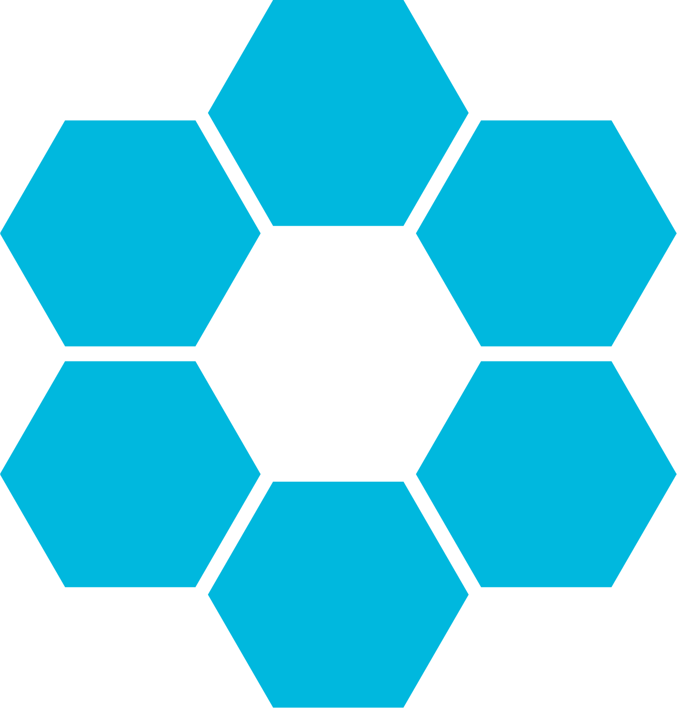
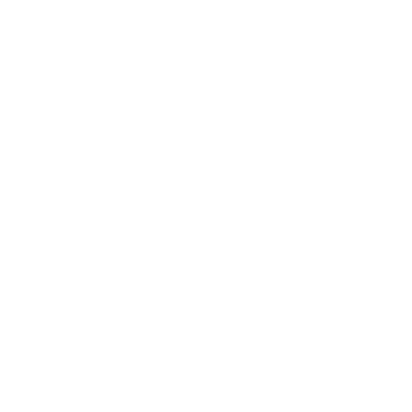

### Hi there 👋
## I'm Truls

Currently working as a System administrator @Helse Vest IKT AS for AD/DNS, Windows Servers and NAS services.

#### What I'm doing/have done:
 - Aug. 2017 - Jun. 2021 - \(\) Computer science student 
 - Sep. 2018 - Dec. 2020 - \(\) Head of IT 
 - Jan. 2020 - Jun. 2020 - \(\) Student assistent in CCNA \(1, 2, 3 \& 4\) 
 - Jan. 2021 - Feb. 2024 - \(\) System administrator 
 - Mar. 2024 - \<Present\> - \() Security Infrastructure Engineer 

#### Some analytics ⚡

#### Trophys 🏆

📫 How to reach me:   <!---->

<!--
**Scadic/scadic** is a ✨ _special_ ✨ repository because its `README.md` (this file) appears on your GitHub profile.

Here are some ideas to get you started:

- 🔭 I’m currently working on ...
- 🌱 I’m currently learning ...
- 👯 I’m looking to collaborate on ...
- 🤔 I’m looking for help with ...
- 💬 Ask me about ...
- 📫 How to reach me: ...
- 😄 Pronouns: ...
- ⚡ Fun fact: ...
-->
