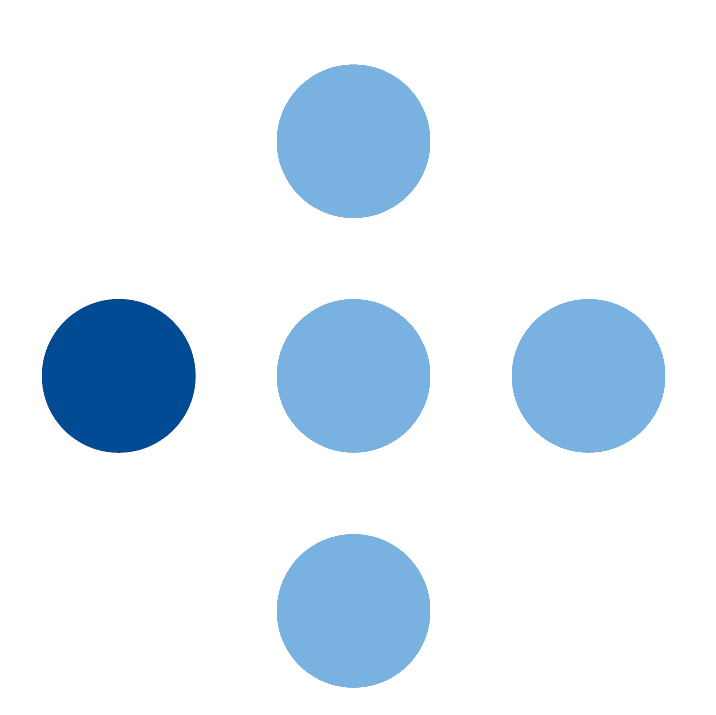

### Hi there 👋
## I'm Truls

Currently working as a Security Infrastructure Engineer @Equinor.

#### What I'm doing/have done:
 - Aug. 2017 - Jun. 2021 - \(\) Computer science student 
 - Sep. 2018 - Dec. 2020 - \(\) Head of IT 
 - Jan. 2020 - Jun. 2020 - \(\) Student assistent in CCNA \(1, 2, 3 \& 4\) 
 - Jan. 2021 - Feb. 2024 - \(\) System administrator 
 - Mar. 2024 - \<Present\> - \(\) Security Infrastructure Engineer 

#### Some analytics ⚡

#### Trophys 🏆

- 🔭 I’m currently working on whatever I want
- 🌱 I’m currently learning how to not give a damn
- 👯 I’m looking to collaborate on interesting stuff
- 🤔 I’m looking for help with NULL
- 💬 Ask me about Windows/Servers/IT Infrastructure
- 📫 How to reach me: Just don't!
- 😄 Pronouns: ♂ 🜁🜂🜃🜄
- ⚡ Fun fact: I used to TA in a subject that taught CCNA

<!--
📫 How to reach me: 
 

**Scadic/scadic** is a ✨ _special_ ✨ repository because its `README.md` (this file) appears on your GitHub profile.

Here are some ideas to get you started:
-->

